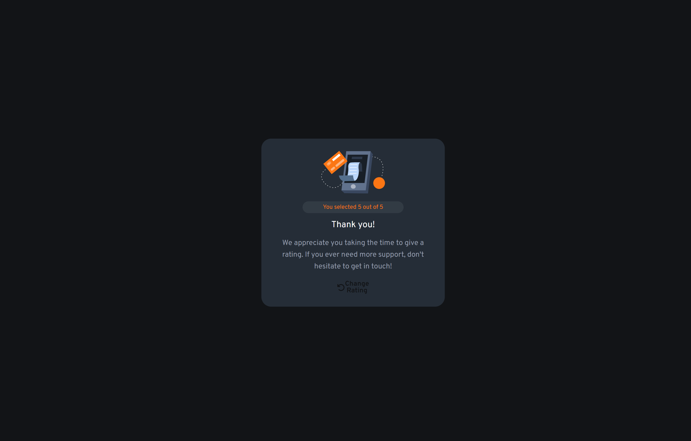

# Frontend Mentor - Interactive rating component solution

This is a solution to the [Interactive rating component challenge on Frontend Mentor](https://www.frontendmentor.io/challenges/interactive-rating-component-koxpeBUmI). Frontend Mentor challenges help you improve your coding skills by building realistic projects. 

### Screen Shot
- First State


- Final State


### Built with

- Semantic HTML5;
- CSS custom properties;
- Flexbox;
- Responsive Desgin;
- JavaScript.


## Some code I'm proud of

- CSS
```css
input:checked + label .container__button {  /*Here I hadt o create this relation to change the color off the "button" when it's checked*/
    background: var(--Orange);
    color: var(--White);
    border: 1px solid var(--Orange);
}
```

- JavaScript
```js
function getRating () {
    let checkbox = document.querySelector('input[name="rating"]:checked');
    let rating = checkbox.value
    console.log(rating)
    place_rating.innerText = rating
}
```

- [Video that helped me a lot](https://www.youtube.com/watch?v=vybZtSa3ofY)

## Test the project on your device: [Teste the project here!!!](rating-responsive.vercel.app)

- Min-widths: 1440px - 1024px - 768px

## Author

- Website - [Lucas Bailo](https://github.com/lucasbailo)
- Frontend Mentor - [@lucasbailo](https://www.frontendmentor.io/profile/lucasbailo)
- Instagram - [@lucassbailo](https://www.instagram.com/lucassbailo/)
- LinkedIn - [Lucas Bailo](https://www.linkedin.com/in/lcsbailo/)

